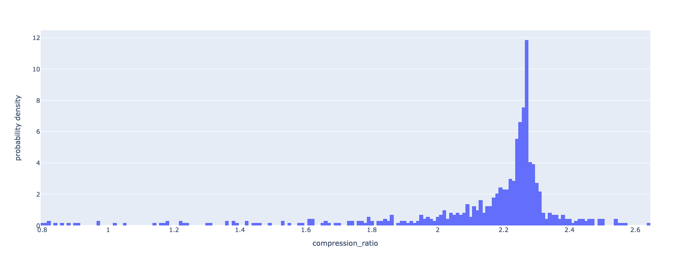
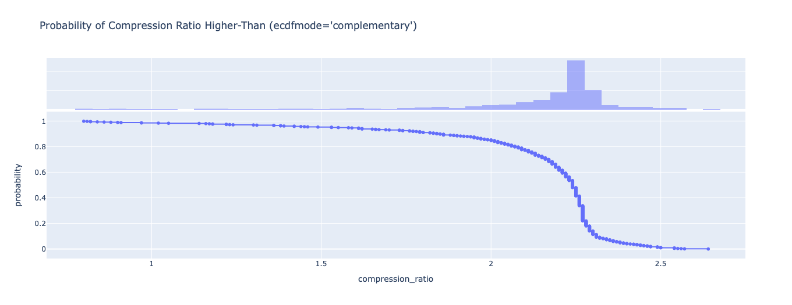

# [Neuralink Compression Challenge](https://content.neuralink.com/compression-challenge/README.html)

by nikolay.dubina.pub@gmail.com on 2024-05-23

Compression Ratio 2.09

65% of input samples have 2.2 or better compression ratio



Algorithm
- read `int16`, if N > 0, then next N samples are encoded, if N < 0 then next abs(N) samples are not encoded
- cache `1024` most frequently observed samples so far, update cache on every encoding/decoding
- use index of top among `128` values in cache to encode in `int7`
- encoding only continuous blocks of `8` bytes, pack 8x`int7` into 7x`int8` 
- keep original WAV header, overwrite only data segments

Properties
- Does not use information within single sample, only sample equality among other samples and their chronology is used
- Adaptive Dictionary
- Fixed-Length Coding
- Byte-Aligned Coding
- Turn Off/On Switch
- No External Libraries

Example

```
<encoded bytes>: description
```

```
1111111111111000: marker next 8 samples encoded=false
1111110111011111 -> 1111110111011111
1111110100011111 -> 1111110100011111
1111101101011111 -> 1111101101011111
1111110000011111 -> 1111110000011111
1111101011011111 -> 1111101011011111
1111010011011101 -> 1111010011011101
1110111101011100 -> 1110111101011100
1111010001011101 -> 1111010001011101
0000000100100000: marker next 288 samples encoded=true
1111101011011111 -> N/A (most significant bits in next 7 bytes)
1111110010011111 -> 10110100: only least-significant 7 bits
1111111100100000 -> 00101110: only least-significant 7 bits
1111111001100000 -> 00111101: only least-significant 7 bits
1111111011100000 -> 00001101: only least-significant 7 bits
1111110100011111 -> 00111001: only least-significant 7 bits
1111101111011111 -> 00111110: only least-significant 7 bits
1111101101011111 -> 01001011: only least-significant 7 bits
1111101111011111 -> N/A (most significant bits in next 7 bytes)
1111100111011110 -> 01001101: only least-significant 7 bits
1111100001011110 -> 11101000: only least-significant 7 bits
1111101010011111 -> 11001010: only least-significant 7 bits
1111101100011111 -> 11001110: only least-significant 7 bits
1111110100011111 -> 10111001: only least-significant 7 bits
1111110100011111 -> 10111001: only least-significant 7 bits
1111110111011111 -> 00011000: only least-significant 7 bits
1111111000100000 -> N/A (most significant bits in next 7 bytes)
...
```

Other Materials
- `/go-encoder` - Go version
- `/research` - research code and Python version

## References

* http://tiny.systems/software/soundProgrammer/WavFormatDocs.pdf
* https://iopscience.iop.org/article/10.1088/1741-2552/acf5a4
* https://docs.scipy.org/doc/scipy/reference/generated/scipy.io.wavfile.read.html
* https://docs.python.org/3/library/wave.html
* https://en.wikipedia.org/wiki/Variable-length_code
* https://en.wikipedia.org/wiki/Prefix_code
* https://rosettacode.org/wiki/Huffman_coding#Python
* https://golang.google.cn/src/compress/bzip2/huffman.go
* https://github.com/go-audio/wav
* https://github.com/bearmini/bitstream-go
* https://github.com/icza/bitio
* https://github.com/icza/huffman
* https://github.com/studiawan/data-compression
* https://en.wikipedia.org/wiki/Adaptive_Huffman_coding
* https://github.com/kei-g/vitter
* https://en.wikipedia.org/wiki/Deflate
